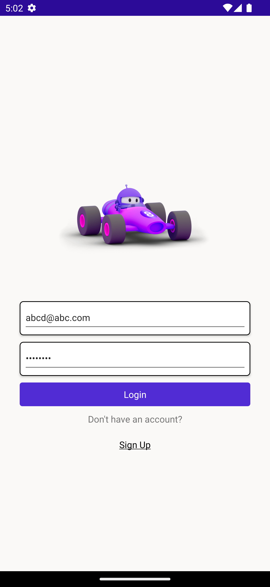
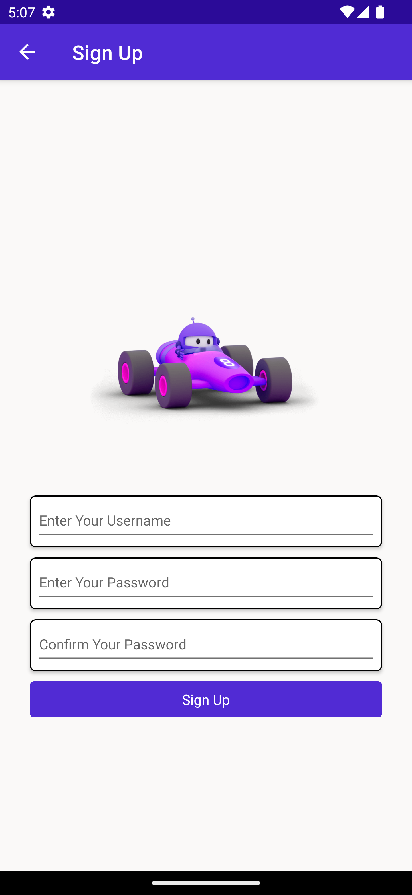
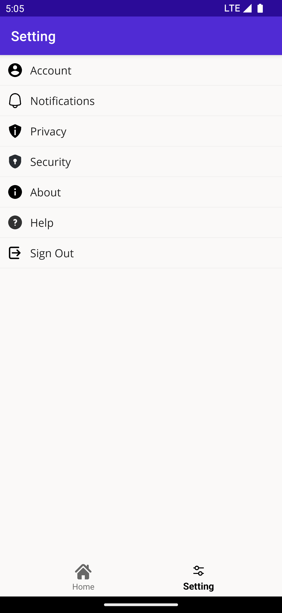
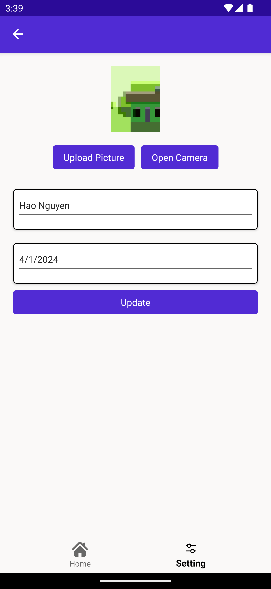

# Awesome Project

This is a C# project using .NET 8.0 and Docker.

## Prerequisites

- .NET 8.0 SDK
- Microsoft Visual Studio
- Microsoft SQL Server
- Microsoft SQL Server Management Studio
- Docker

## How to Run

1. Clone the repository:
    
    ```bash
    git clone https://github.com/nhao2003/basic-asp.git
    ```
2. Navigate to the project directory:
    
    ```bash
    cd awesome
    ```
3. Build the Docker image:
        
   ```bash
   docker-compose build
   ```
4. Run the Docker container:
        
   ```bash
   docker-compose up
   ```
5. Open your browser and navigate to `http://localhost:8000`.

# Awesome UI

<p float="left">
  
   
  
  
  
</p>