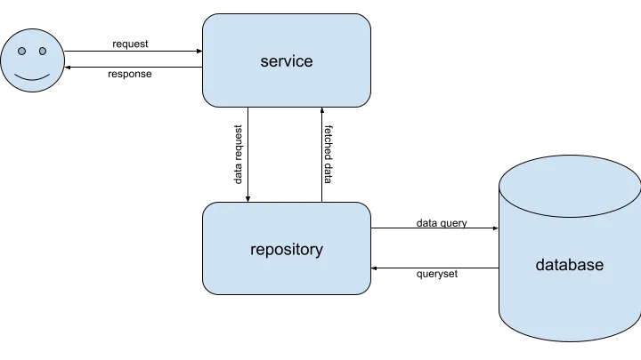

# Awesome Project

This is a C# project using .NET 8.0 and Docker.

## Architecture

### Service Repository Pattern

#### What is a service-repository pattern?

A service-repository pattern is a low-level design pattern mainly used to separate the concerns in a software project. It comprises two layers i.e; a service layer and a repository layer. Mostly, this pattern is used as an abstraction layer over the MVC(Model-View-Controller) or MVT(Model-View-Template) design patterns.



##### Service-repository layers

**Service layer**

* This layer is the point of contact in this pattern. This layer performs the actual business logic for the given request and queries the repository layer for any “single unit business object related operations”.
* Multi-unit business object operations or any business logic operation(eg. response formatting, mixing two different sets of single unit business object operation results, performing calculations on data) takes place in this layer.
* The service layer cannot directly interact with business unit objects or database models. It queries the repository layer of a particular business object for results/data.
* A service layer can access/query multiple repositories.

**Repository layer**

* This layer is responsible for all the operations, mostly CRUD and sometimes more complex, related to a single business unit or a database model/table.
* It hides all the data-related operations and refrains the service layer to interact with the data objects directly.
* The models are not defined in this layer directly but as per the logic of the pattern, can only be accessed from this layer.
* Multiple business units or models/tables cannot be accessed inside a single repository. Each repository will only be responsible for a single model/table.

## Prerequisites

- .NET 8.0 SDK
- Microsoft Visual Studio
- Microsoft SQL Server
- Microsoft SQL Server Management Studio
- Docker

## How to Run

1. Clone the repository:
    
    ```bash
    git clone https://github.com/nhao2003/basic-asp.git
    ```
2. Navigate to the project directory:
    
    ```bash
    cd awesome
    ```
3. Build the Docker image:
        
   ```bash
   docker-compose build
   ```
4. Run the Docker container:
        
   ```bash
   docker-compose up
   ```
5. Open your browser and navigate to `http://localhost:8000`.

# Awesome UI

<p float="left">
  
   
  
   
  
  
  
</p>